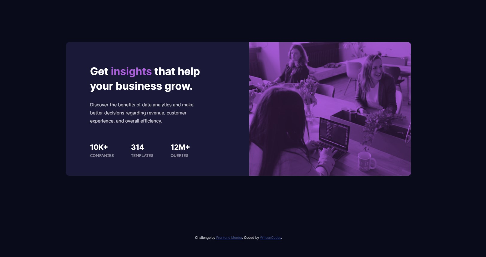

# Frontend Mentor - Stats preview card component solution

This is a solution to the [Stats preview card component challenge on Frontend Mentor](https://www.frontendmentor.io/challenges/stats-preview-card-component-8JqbgoU62). Frontend Mentor challenges help you improve your coding skills by building realistic projects. 

## Table of contents

- [Overview](#overview)
  - [The challenge](#the-challenge)
  - [Screenshot](#screenshot)
  - [Links](#links)
- [My process](#my-process)
  - [Built with](#built-with)
  - [What I learned](#what-i-learned)
  - [Useful resources](#useful-resources)
- [Author](#author)

## Overview

### The challenge

Users should be able to:

- View the optimal layout depending on their device's screen size

### Screenshot

### Links

- Solution URL: [Solution](https://www.frontendmentor.io/solutions/responsive-stats-preview-card-component-W5CZV7UOI)
- Live Site URL: [Live Site](https://w1lsoncodes.github.io/stats-preview-card-component-main/)

## My process

### Built with

- HTML5
- CSS3
- Flexbox

### What I learned

This is my first front end project, i have learned how to properly use flexbox for the layout of the site.

### Useful resources

- [MDN Web Docs - Responsive Images](https://developer.mozilla.org/en-US/docs/Learn/HTML/Multimedia_and_embedding/Responsive_images) - This allowed me to use the image tag in a new way. Allowing a more responsive feel.
- [CSS Tricks - A Complete Guide to Flexbox](https://css-tricks.com/snippets/css/a-guide-to-flexbox/) - This allowed me to use the image tag in a new way. Allowing a more responsive feel.

## Author

- Frontend Mentor - [@w1lsoncodes](https://www.frontendmentor.io/profile/w1lsoncodes)
